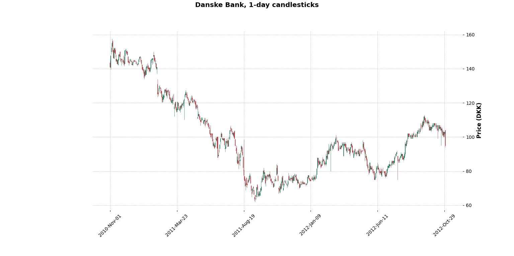

<a name="readme-top"></a>
<!-- PROJECT LOGO -->
<br />
<div align="center">
  <a href="https://github.com/Andreas1331/sp_exam">
    
  </a>

<h3 align="center">Stock Trading Library</h3>

  <p align="center">
    A C++ solution to load JSON files containing stock trading history to then test out trading strategies upon.
    <br />
    <a href="https://github.com/Andreas1331/sp_exam/tree/main/project"><strong>Explore the code</strong></a>
    <br />
    <br />
  </p>
</div>


<!-- TABLE OF CONTENTS -->
<details>
  <summary>Table of Contents</summary>
  <ol>
    <li><a href="#about-the-project">About The Project</a></li>
    <li>
      <a href="#getting-started">Getting Started</a>
    </li>
    <li><a href="#license">License</a></li>
    <li><a href="#contact">Contact</a></li>
        <li><a href="#acknowledgments">Acknowledgments</a></li>
  </ol>
</details>


<!-- ABOUT THE PROJECT -->
## About The Project

The project is my solution to an exam assigment consisting of ten smaller assignments. For the exam the overall idea was to load files efficiently into memory, compute their candle-stick trajectories and invoke various strategies using this formatted data. Finally the project had to contain unit testing in some capacity and smart use of parallel computation in order to speed up things. The output of running the program is an overview of how well a strategy performed on the selected stock, and some graphs to provide visual aid. There were no requirements on how to solve the tasks, and my thought was to make it possible to create *n* many strategies as long as they inherit from the base strategy class. This makes it possible to compare different strategies to each other by pretty printing their results.

The plotting is done using Python by adding a command using CMake that will start the ``plotter.py``. All unit testing is done using ``doctest``, and the file ``json.hpp`` is not originally mine but provided for the exam. However, it was modified to fit the project intentions.

It is not useful in any real-life application besides getting familiar with C++. The exam assignment can be found inside 
```
sp_exam/assignment/description.pdf
```


<p align="right">(<a href="#readme-top">back to top</a>)</p>


<!-- GETTING STARTED -->
## Getting Started

To get started simply let your preferred IDE load the CMake, and make sure to have C++ 20.

<p align="right">(<a href="#readme-top">back to top</a>)</p>


<!-- LICENSE -->
## License

Distributed under the MIT License. See `LICENSE.txt` for more information.

<p align="right">(<a href="#readme-top">back to top</a>)</p>


<!-- CONTACT -->
## Contact

Andreas  - **Website to be inserted**

<p align="right">(<a href="#readme-top">back to top</a>)</p>

